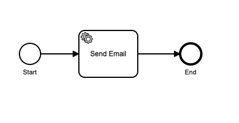

# Getting Started with Camunda Cloud and Node.js

This project uses the [Zeebe Node Client](https://github.com/camunda-community-hub/zeebe-client-node-js) to connect to Camunda Cloud.

It demonstrates how to:

* Create a ZBClient that connects to a Camunda Cloud cluster
* Deploy a process model to Camunda Cloud
* Create a process instance in Camunda Cloud
* Create a worker that services jobs
* Integrate Camunda Cloud behind a REST front-end

This project does not contain best practices for application structure. If you are looking for a highly opinionated project structure for Node.js, you might consider using the Zeebe NestJS integration and the NestJS framework.

## Prerequisites

* [Node.js](https://nodejs.org)
* [Camunda Cloud account](https://camunda.io)
* [Zeebe Modeler](https://github.com/zeebe-io/zeebe-modeler/releases)

## Setup 

## Clone the project

* Clone this repo.

* Change directory into the cloned repository.

* Install dependencies in the project:

```bash
npm i 
```

## Create Camunda Cloud cluster

If you don't already have one, you will need to create a cluster in Camunda Cloud. The full procedure is documented [here](https://docs.camunda.io/docs/guides/getting-started/create-cluster).

* Log in to [https://console.cloud.camunda.io](https://console.cloud.camunda.io).
* Create a new Zeebe 1.x.y cluster.
* When the new cluster appears in the console, create a new set of client credentials. 
* Download the client credentials `.txt` file.

## Start the project

* Run the command:

```bash
npm start
```

* Open [http://localhost:3000](http://localhost:3000) in your browser.

This command will install all dependencies and build the front-end and backend, and then run the REST server and Zeebe workers using [`nodemon`](https://nodemon.io/). When you make changes to the configuration of the application, the server component will automatically restart.

## Configure connection

You have two options here - via the Web UI or via the `.env` file. 

### Option 1: Via Web UI 

* Open [http://localhost:3000](http://localhost:3000) in your browser.
* Upload the client credentials `.txt` for your cluster. 

### Option 2: Via `.env` file

* Create a file `.env` in the root of the project
* Paste the client connection environment variable block 
* Delete the `export` from in front of each line in the file

You will end up something that looks like this:

```bash
ZEEBE_ADDRESS='231bb36a-1588-4f1e-b4f6-e09944d7efd7.zeebe.camunda.io:443'
ZEEBE_CLIENT_ID='Ny-WTmQniq4XluEG0_L9KAl-G8~i_dH1'
ZEEBE_CLIENT_SECRET='9QZWpArT_2C1jU7Kru3Kll~7Hev9jyMsuo5tCk2ko0ZpzNRDb7nbiVqmcUBL'
ZEEBE_AUTHORIZATION_SERVER_URL='https://login.cloud.camunda.io/oauth/token'
```

* Save the file.

## Project structure

This Getting Started Guide project is structured as:

* A simple JavaScript front-end application written in [Svelte](https://svelte.dev/)
* A Node.js Express REST API 
* Camunda Cloud integrations consisting of process models, process model deployment, Zeebe workers, and process instance creation route handlers.

### Front End

The front-end application is in the `client` directory. It uses the [bpmn.io](https://bpmn.io/) BPMN Model Viewer to display the BPMN process models in the browser.

### Node.js REST API 

The server is in the `src/rest/server.ts` file. It has some routes to allow you to configure the application from the front-end, and the Express application is exported to allow Getting Started Scenarios to add route handlers.

### Camunda Cloud integration

The process models are found in the `bpmn` directory.


## Test Connection with Camunda Cloud 

When the application is configured, the [`camundaCloudClusterConnection`](http://localhost:3000/camundaCloudClusterConnection) endpoint will connect to the Zeebe cluster in Camunda Cloud, and return its topology.

It does this by using the `ZBClient.topology()` method in the implementation in `src/server.ts`.

## Scenarios

## Scenario 1: Send an Email

The first scenario sends an email using the SendGrid API from a Camunda Cloud worker. It demonstrates a transactional email task that uses a template specified in a custom header on the task. A more fully featured implementation can be found in [this blog post](https://camunda.com/blog/2019/10/nestjs-tx-email/).

### Structure



The model is in [`bpmn/send-welcome-email.bpmn`](/bpmn/send-welcome-email.bpmn). It has a single service task in it. The worker that handles jobs of this type can be found in [`src/sendemail/workers.ts`](/src/sendemail/workers.ts).

The code to deploy the process model and create (start) an instance of the process can be found it [`src/sendmail/process.ts`](/src/sendmail/process.ts).

The REST handler for starting a process instance is in [`src/sendemail/rest.ts`](/src/sendemail/rest.ts).

### Setup

You will need a [SendGrid](https://app.sendgrid.com/) account (you can use the free tier) and an API key.

You have two options to configure the SendGrid API Key and Sender Email - via the Web UI, or via the `.env` file.

### Option 1: Via Web UI 

* Open [http://localhost:3000](http://localhost:3000) in your browser.
* Click on `SendGrid API Key` and enter your SendGrid API Key, then press `Update SendGrid API Key`.
* Click on `SendGrid Sender Email` and enter the address that you verified as a sender email in your SendGrid account, then press `Update SendGrid Sender Email`.

### Option 2: Via `.env` file

* Edit the `.env` file and set the values for `SENDGRID_API_KEY` and `SENDGRID_SENDER_EMAIL`.

## Create a process instance

To create a process instance, provide a value for the name of the recipient and their email in your web browser, then press `Create Process Instance`.

This calls the REST route handler in [`src/sendemail/rest.ts`](/src/sendemail/rest.ts), which creates a process instance and returns the metadata from Camunda Cloud to the browser, where it is displayed in an alert and in the JS console.

You can then view the process instance in [Operate](https://docs.camunda.io/docs/product-manuals/operate/index), the process monitoring component of Camunda Cloud.

## Scenario 2: Implement a Decision Gateway

In this scenario, the process implements a decision gateway with two different pathways through the process. The process outcome is also awaited, so the eventual outcome of the entire process is passed back to the client app by the REST server.

### Structure


The model is in [`bpmn/process-attachment.bpmn`](/bpmn/process-attachment.bpmn). The model uses a decision gateway BPMN symbol, with a [FEEL expression](https://docs.camunda.io/docs/product-manuals/concepts/expressions) as the condition on one of the branches (the other branch is set as the default flow).


The model has two service tasks in it, one on each pathway after the decision gateway. These workers can be found in [`src/decision-gateway/workers.ts`](/src/decision-gateway/workers.ts).

The code to deploy the process model and create (start) an instance of the process can be found it [`src/decision-gateway/process.ts`](/src/decision-gateway/process.ts). This uses the `createProcessInstanceWithResult` method, which awaits the eventual outcome of the process.

The REST handler for starting a process instance is in [`src/decision-gateway/rest.ts`](/src/decision-gateway/rest.ts).

## Create a process instance

Either check the checkbox to specify that the process payload has an attachment, or leave it unchecked. Then, press the `Create Process Instance` button. A process instance will run, and the outcome will be displayed in an alert.

The `outcome` field of the `variables` object will contain a message that lets you know which decision pathway was taken, and which worker processed the payload.